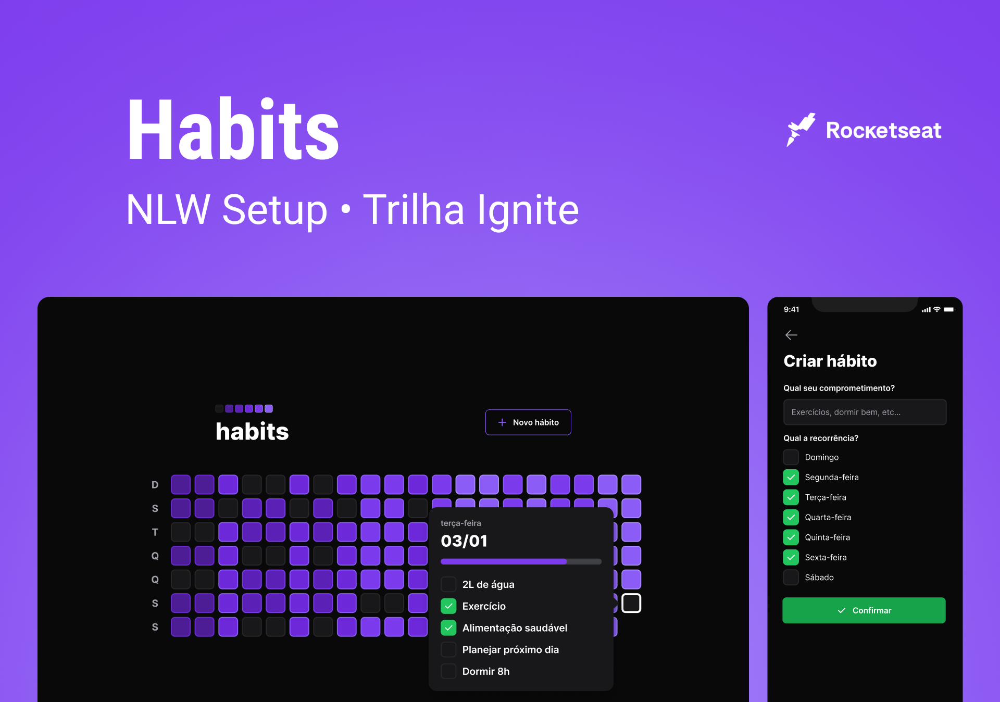
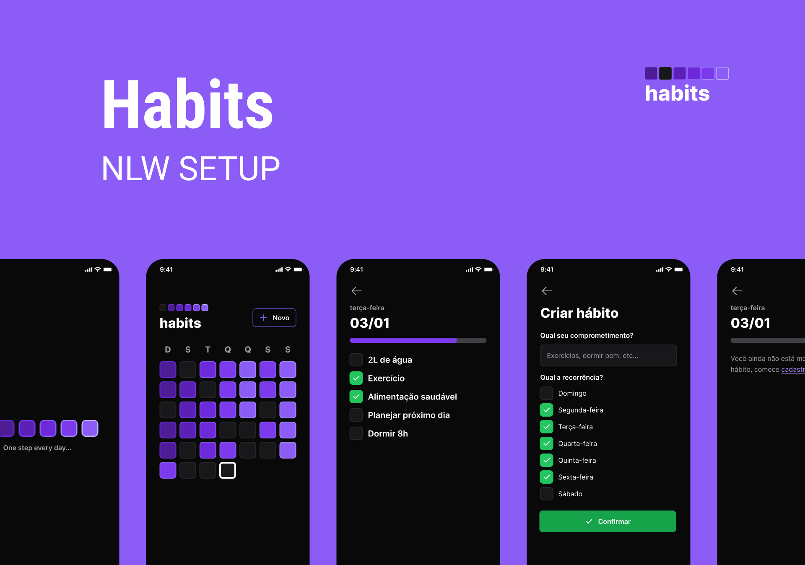
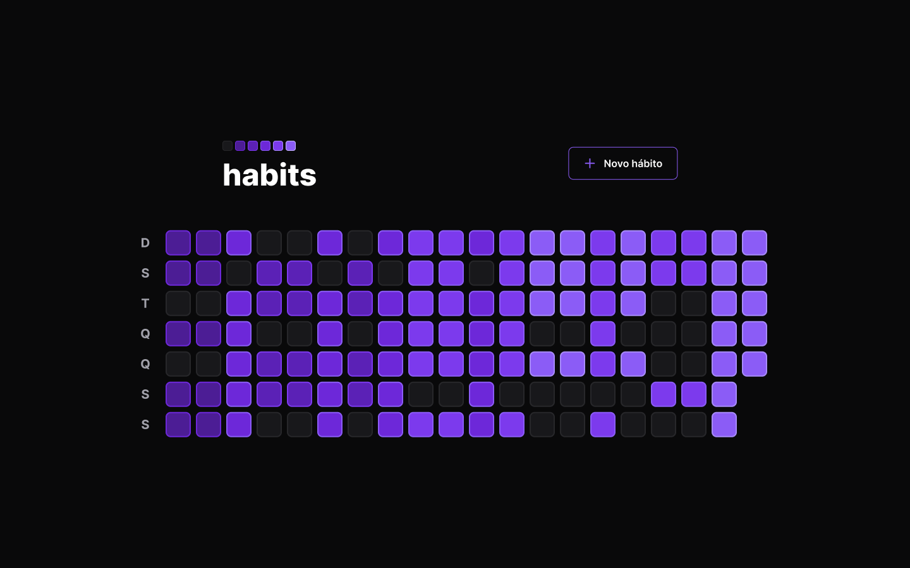
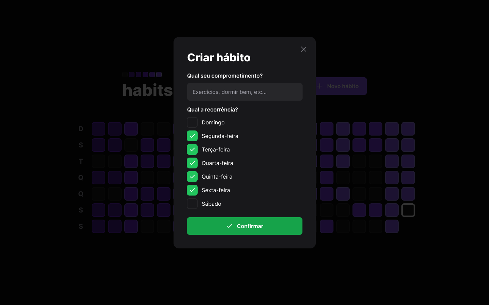
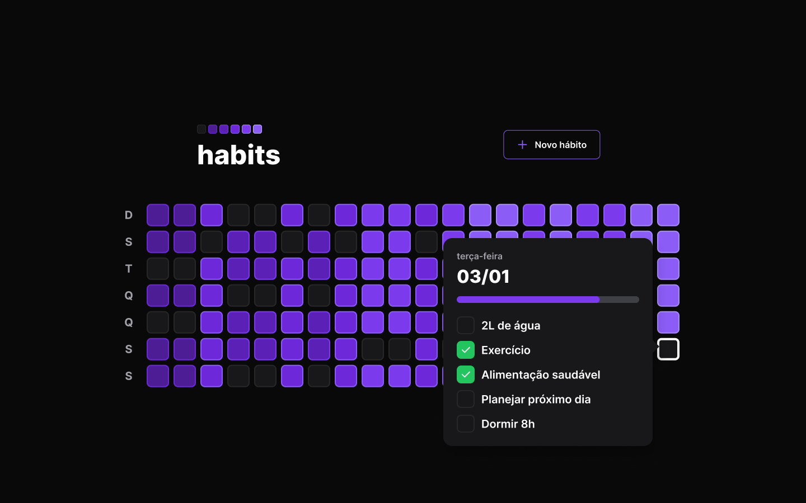

# NLW SETUP - Habits 

O Habits é um aplicativo de controle de hábitos desenvolvido durante a [NLW Setup](https://nlw.rocketseat.com.br/convite/rodolfo-214). Ele ajuda os usuários a colocar em prática suas resoluções e metas, permitindo que eles registrem suas ações e acompanhem a evolução dos novos hábitos que desejam incluir em sua rotina. Construimos uma aplicação de ponta a ponta, desde a [API Restful](https://github.com/rodolfosouzamenezes/nlw-setup/tree/master/server) até as versões [Web](https://github.com/rodolfosouzamenezes/nlw-setup/tree/master/web) e [Mobile](https://github.com/rodolfosouzamenezes/nlw-setup/tree/master/mobile), utilizamos as tecnologias ReactJS, React Native, Expo, NodeJS, Fastify, Tailwind, NativeWind, Typescript e Javascript.
Para participar deste desafio, [clique aqui](https://nlw.rocketseat.com.br/convite/rodolfo-214) para se cadastrar.

Para conferir o Deploy da versão web, [clique aqui](https://nlw-setup-beta.vercel.app).

# Demonstração
Aqui você pode conferir um pouco do design do Habit, para conferir o projeto no Figma, [clique aqui](https://www.figma.com/community/file/1195326661124171197).

## Mobile - Screens

## Web - Home

## Web - New Habit

## Web - Habit Example

